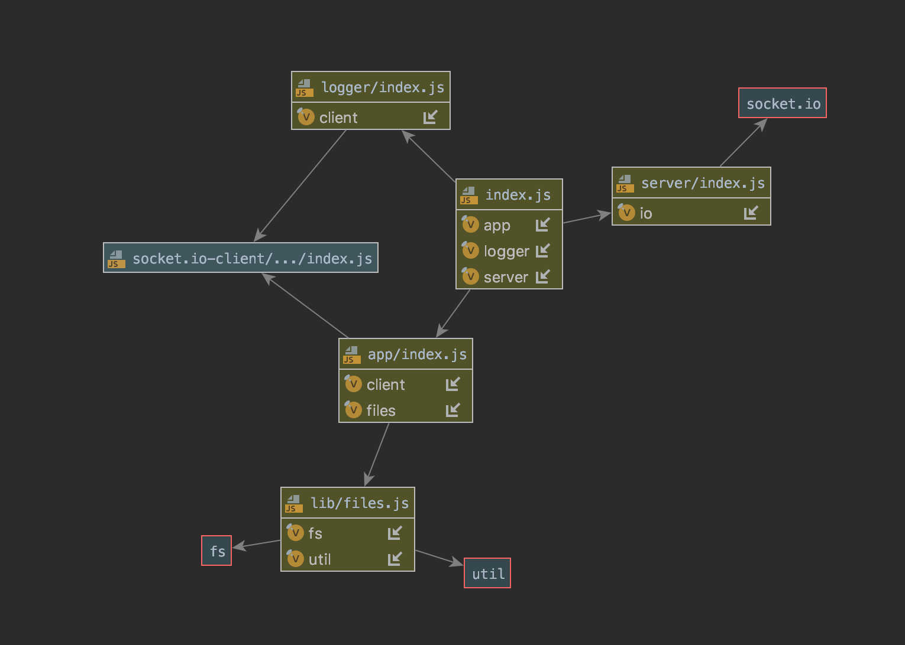

# LAB - 17

## Socket.IO

### Author: Austin Hedeen

### Links and Resources
* [submission PR](https://github.com/austinhedeen-401-advanced-javascript/lab-17/pull/1)
* [travis](https://travis-ci.com/austinhedeen-401-advanced-javascript/lab-17)

### Modules
#### `app.js`
##### Alters a file using the `files.js` module

#### `logger.js`
##### Exported Values and Methods

###### `start()`
Connects to the `server` and waits for messages to log.

###### `handleSave(payload)`
Logs a success message and the payload to the console.

###### `handleError(payload)`
Logs an error message and the payload to the console.

#### `server.js`
##### Starts a Socket.IO server

#### `files.js`
##### Exported Values and Methods

###### `readFile(filename) -> Promise<Buffer>`
Takes a filename and returns a promise with the file's data.

###### `writeFile(filename, data) -> Promise`
Takes a filename and a data buffer, and returns a promise upon completion.

###### `convertBuffer(data) -> Buffer`
Takes a buffer representing a string, and returns a buffer of that string converted to uppercase.

###### `alterFile(filename) -> Promise`
Takes a filename, converts that file's contents to uppercase, and returns a promise upon completion.

#### Running the app
- `npm run server`
  - starts a `socket.io` server at port 3000
- `npm run logger`
  - starts a client that connects to `server` and logs messages
- `npm run app`
  - starts a client application that connects to `server` and alters a local file located at `files/test.txt`, emitting an event upon completion or error
  
#### Tests
- `npm test`

#### UML

